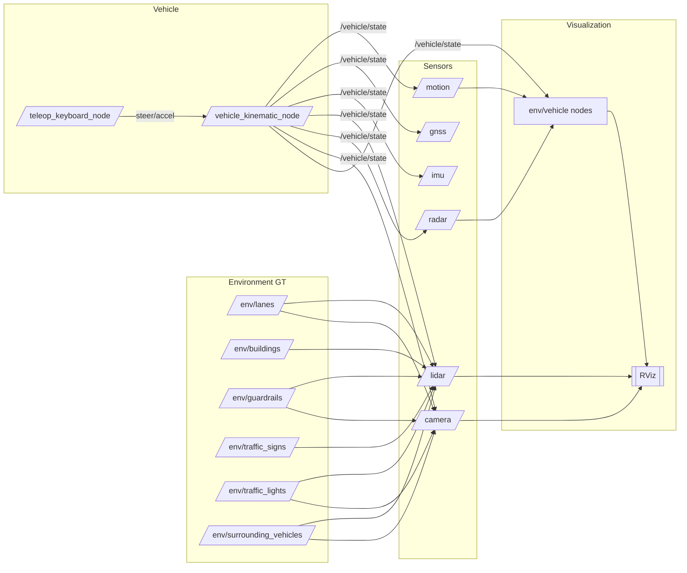

# NGV DCAS Perception Simulation — 기술 개요

본 문서는 DCAS 인지 시뮬레이션(ROS1)의 저장소 구조, 빌드 시스템, 메시지 계약, 런타임 토폴로지, 데이터 흐름을 한눈에 설명합니다.

## 1. 워크스페이스 레이아웃
```
NGV_DCAS_SW/              (catkin 워크스페이스 루트)
├── CMakeLists.txt        (catkin toplevel)
├── build/                (git 무시)
├── devel/                (git 무시)
├── install/              (선택, git 무시)
├── logs/                 (git 무시)
├── .gitignore
└── src/
    ├── dcas_msgs/                # 커스텀 메시지 정의
    │   ├── CMakeLists.txt
    │   ├── package.xml
    │   └── msg/
    │       ├── Lane*.msg
    │       ├── Object*.msg
    │       ├── TrafficLight*.msg
    │       ├── RadarDetection*.msg
    │       └── VehicleState.msg
    └── dcas_perception_sim/      # 환경, 센서, 차량, 시각화 노드
        ├── CMakeLists.txt
        ├── package.xml
        ├── launch/
        │   ├── bringup.launch    # 환경+센서+차량(+텔레옵)
        │   └── rviz.launch       # bringup + RViz + 마커
        ├── rviz/
        │   └── dcas_perception.rviz
        ├── scripts/
        │   ├── env_*.py          # 환경(GT) 퍼블리셔
        │   ├── sensor_*.py       # 센서 에뮬레이터
        │   ├── vehicle_kinematic_node.py   # 3DoF 키네마틱 바이시클
        │   └── teleop_keyboard_node.py     # 방향키 텔레옵
        ├── README_kr.md
        └── USAGE.md
```

## 2. 빌드 & 실행
```bash
# 빌드 및 환경 설정
cd <repo-root>
catkin_make
source devel/setup.bash

# RViz 포함 실행(권장)
roslaunch dcas_perception_sim rviz.launch
# RViz 없이 실행
roslaunch dcas_perception_sim bringup.launch
```

## 3. 패키지
- dcas_msgs: 시스템 전반에서 사용하는 최소 커스텀 메시지 세트
  - Object(.msg), ObjectArray(.msg)
  - Lane(.msg), LaneArray(.msg)
  - TrafficLight(.msg), TrafficLightArray(.msg)
  - RadarDetection(.msg), RadarDetectionArray(.msg)
  - VehicleState(.msg) — 차량 pose/twist, 조향각, 페달 등
- dcas_perception_sim: 노드와 런치 파일
  - 환경 GT 퍼블리셔: 차선, 건물, 가드레일, 신호등, 교통표지, 대향차
  - 센서 에뮬레이터: 모션, GNSS, IMU, LiDAR, Radar, Camera
  - 차량: 3DoF 키네마틱 바이시클 + 키보드 텔레옵
  - 시각화: MarkerArray 퍼블리셔 + RViz 설정

## 4. 런타임 토폴로지(노드/토픽)

- 환경(GT) 퍼블리시
  - `/env/lanes` (dcas_msgs/LaneArray)
  - `/env/buildings`, `/env/guardrails`, `/env/traffic_signs`, `/env/surrounding_vehicles` (dcas_msgs/ObjectArray)
  - `/env/traffic_lights` (dcas_msgs/TrafficLightArray)

- 차량
  - vehicle_kinematic_node.py
    - 구독: `/vehicle/cmd/steer` (std_msgs/Float32), `/vehicle/cmd/accel` (std_msgs/Float32)
    - 퍼블리시: `/vehicle/state` (dcas_msgs/VehicleState)
  - teleop_keyboard_node.py
    - 퍼블리시: `/vehicle/cmd/steer`, `/vehicle/cmd/accel`

- 센서(발췌)
  - Motion: `/sensors/motion/steering_wheel_angle` (std_msgs/Float32), `/sensors/motion/wheel_speed_pulses` (std_msgs/Int32MultiArray)
  - GNSS: `/sensors/gnss/fix` (sensor_msgs/NavSatFix), `/sensors/gnss/odom` (nav_msgs/Odometry)
  - IMU: `/sensors/imu/data` (sensor_msgs/Imu)
  - LiDAR: `/sensors/lidar/points` (sensor_msgs/PointCloud2)
  - Radar: `/sensors/radar/points` (sensor_msgs/PointCloud2)
  - Camera: `/sensors/camera/image_raw` (sensor_msgs/Image)

- 시각화
환경/차량 노드가 `/viz/env/*`, `/viz/vehicle` 토픽으로 시각화 제공

### 센서 입력(구독)
- 모든 핵심 센서는 `/vehicle/state`를 구독하여 에고 모션을 반영함
- LiDAR/Camera는 환경 GT도 구독해 단순 렌더링/샘플링 수행

## 5. 데이터 흐름(Mermaid)


## 6. 키네마틱 바이시클 모델(3DoF)
- 상태: 위치 `(x, y)`, 요각 `(ψ)`, 속도 `(v)`
- 입력: 조향각(deg), 종가속도 `(m/s^2)`
- 갱신식(단순 모델):
  - `ψ̇ = v / L * tan(δ)`
  - `ẋ = v cos(ψ)`, `ẏ = v sin(ψ)`, `v̇ = a`
- 고정 시간 간격 `dt`로 `dcas_msgs/VehicleState` 퍼블리시

## 7. 좌표/프레임
- 데모는 `map` 고정 프레임만 사용(TF 트리 강제 없음)
- 지면 평면(z=0) 가정
- 향후 과제: TF(`map`→`base_link`→센서 프레임), 카메라/라이다 투영 모델링

## 8. 확장 포인트
- 에뮬레이터 고도화(레이캐스팅 LiDAR, FMCW Radar, 카메라 투영)
- 노이즈/지연 모델을 ROS 파라미터로 추가
- 센서 외부 파라미터, 차량 기하, TF 도입
- 환경 프리미티브 확장(`dcas_msgs/Object` 기반)

## 9. .gitignore 정책
- 빌드 산출물(`build/`, `devel/`, `install/`, `logs/`)과 ROS 캐시(`.ros/`, `.catkin_tools/`) 제외
- 파이썬 캐시/IDE 파일 제외
- 대용량 데이터셋(`.bag`, `.pcd` 등) 기본 제외

## 10. 트러블슈팅
- 런치 파일 인식 안 됨: `devel/setup.bash` 소스 후 `ROS_PACKAGE_PATH`에 `<repo-root>/src` 포함 확인
- RViz에 마커 미표시: `/viz/markers` 토픽과 Fixed Frame=`map` 확인
- 텔레옵: 터미널 포커스 필요, `q` 종료, Space 리셋
